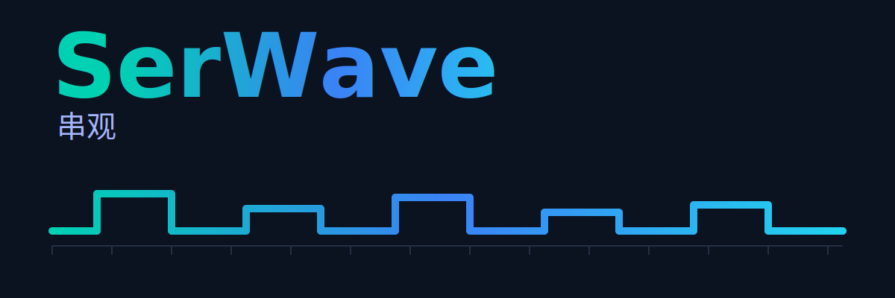

# 串观 · SerWave

轻量、跨平台的串口调试与总线波形可视化工具。



架构：**Rust + Slint**（GUI），多包 **Cargo workspace** 管理。

## 目录结构
```
serwave/                 # 仓库根
  Cargo.toml             # workspace 根清单
  .gitignore
  README.md
  .github/
    workflows/
      ci.yml             # CI：三平台构建与测试
  crates/
    serwave-app/         # GUI 二进制（Slint）
    serwave-core/        # 核心库：串口封装、日志、配置
    serwave-decode/      # 协议解码（I2C/SPI/UART...）
```

## 快速开始
```bash
# 构建（桌面）
cargo build -p serwave-app

# 运行 GUI
cargo run -p serwave-app
```

## 开发路线

### v0.1 (MVP) - 串口调试工具
- [x] 串口管理
  - [x] 端口枚举与友好名称显示（VID:PID/厂商/产品）
  - [x] 打开/关闭端口，配置波特率/数据位/停止位/校验位
  - [x] 控制信号支持（DTR/RTS/CTS/DSR）
- [x] 收发视图
  - [x] 文本模式与 HEX 模式切换
  - [x] 时间戳显示
  - [x] 行缓冲（混合策略：优先按 `\n` 分行，超时 100ms 或超过 1KB 强制输出）
  - [ ] RX/TX 过滤
  - [ ] 关键字高亮
- [x] 发送功能
  - [x] 文本发送
  - [x] 行尾设置（CR/LF/CRLF）
  - [ ] HEX 发送
  - [ ] 发送预设管理
- [x] 日志持久化
  - [x] 环形缓冲区
  - [ ] 异步落盘（文本 + 原始字节）

**待优化（v0.1.x）**
- [ ] RX 行分隔符配置（Auto/CR/LF/CRLF/Time-gap）
- [ ] 显示映射（显示为 CRLF、显示控制字符、自动换行）
- [ ] 本地回显开关
- [ ] 协议视图（Frames）用于 NMEA/Modbus 等帧协议
